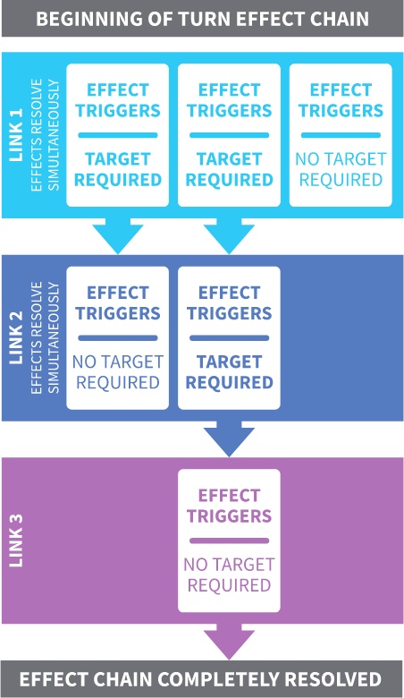

# Game description

The following chapter describes the mechanics of the game in detail.

First, we will describe the terminology used in the game. It has a lot of keywords
so the first section can be used as a glossary.
Then we will look at the effects in more detail.
After that, we will describe how the effects of cards are resolved.
And finally, we will talk about impossible actions.

## Terminology

Terminology of places (card **sources**) where cards can be stored are:

- **Stable** - The area where the player plays Unicorn cards, Upgrades cards
and Downgrades cards.
- **Nursery** - The area where baby unicorns are stored when no player owns them.
- **Deck** - The face-down pile of cards from which the players draw cards.
- **Discard pile** - The face-up pile of cards where the players put cards
when they are "destroyed" or "played".

The cards can have various keywords, and most of them are used in this thesis. Many keywords can be similar to those from other card games, but sometimes the meaning can be slightly different.

- **Sacrifice** - Send a card from **your** stable to the discard pile.
- **Destroy** - Send a card from **any other** player's stable to the discard pile.
- **Steal** - Move a card from **any other** player's stable into **your** stable.
- **Discard** - Send a card from **your** hand to the discard pile.
- **Pull** - The player gets a random card from the source and puts it into his hand.
- **Choose** - The player chooses a card from the source and puts it into his hand.
- **Search** - The effect is similar to choose card effect. The player selects a card from the source. This card is **revealed** to all players and put into his hand.
- **Draw** - Pull a card from the deck (Draw a card from the top of the pile).
- **Play** - It refers to playing a card from your hand during the Action Phase or playing an Instant card. When the card is being played, any other player can react to the card by instant card.
- **Bring** - Move a card to the stable. The brought card cannot be Neigh'd (it is impossible to disallow putting the card to the stable).

Each card has one of the following types:

- **Unicorn** card - The card is a unicorn and can be put into **any** stable. The unicorn type has one of these subtypes:
    - **Baby unicorn** card - The baby unicorn can occur only in the nursery or in the player's stable.
    - **Basic unicorn** card - The unicorn without any special effects.
    - **Magic unicorn** card - The unicorn that has some effect.
- **Upgrade** card - The card grants some positive effects. The upgrade card can be played into **any** stable.
- **Downgrade** card - The card grants some negative effects. The downgrade card can be played into **any** stable.
- **Magic** card - The card with a one-time effect (spell). It takes effect immediately when it is played and then is discarded.
- **Instant** card - The card that can be played at any time when any other player plays a card (unless the card says otherwise). If the instant card is played, then you can react to that card by playing the instant card (even though you already played the card this turn). Any number of instant cards can be chained during a single turn.

Some effects target one or more players, but sometimes it can be unclear whether the statement includes you. Therefore, there is precise wording in the effect description. The following terminology for player targeting is used:

- **Any player** - Refers to any player in the game, __including__ you.
- **Any other player** - Refers to any player in the game, __excluding__ you.
- **Each player** - Refers to each player in the game, __including__ you.
- **Each other player** - Refers to each player in the game, __excluding__ you.
- **Any number of players** - Refers to any number of players you choose, __excluding__ you.

## Types of effects

The game has three types of effects: one-time effect, continuous effect, and trigger effect. The one-time effect has an immediate disposable impact on the game. For example, _Steal a unicorn card_.
The continuous effect is active as long as the card is in your stable. For instance, _All your unicorns are pandas_ (Pandamonium). This effect can be beneficial because all effects that target unicorns cannot target the player's pandas, but the player cannot win because the player has no unicorns in his stable!
The trigger effect is activated when some event occurs. For example, _If this card is in your Stable at the beginning of your turn, you may draw an extra card._ (Extra Tail). An extra card means that the player may draw a card in the draw phase if the player has drawn a card. If some effect disallows the player to draw a card or even skip the draw phase, the player cannot draw an extra card.

For some effects like __draw an extra card__, it is good to consult more detailed rules on the official wiki. Sometimes there are described some special cases.

Effects can be combined in different ways. The first combination is simple "and". Perform the first and the second effect simultaneously. The second combination is "then".
The first effect must be resolved, then the second effect.
The last combination is conditional "if you do". The effect after "if you do" is performed only if the player performed the first effect. For example, _If this card is in your stable at the beginning of your turn, you may sacrifice a card. If you do, destroy a card._ (Glitter bomb).

## Resolving of cards effects

In this section, we will describe the core of the game mechanics -- how the effects of the cards are resolved.

At the same time, one or more effects must be resolved. Typically more effects must be resolved at the beginning of the turn or the end of the turn. Effects that must be resolved at the same time must be resolved simultaneously and independently. These effects are in the first chain link.

The term chain link comes from the fact that the effects make a chain in resolution. The first trigger effect is triggered by some effect and then the second trigger effect is triggered by the first effect and so on. These effects make a chain and the chain link is one whole resolution step.

After the first chain link is resolved simultaneously and independently, some effects may be triggered as a reaction to the first chain link. All these triggered effects form the second chain link. This is repeated until the next chain link is empty. The card is resolved when the whole effect chain is resolved (all chain links are resolved).

{width=174px height=300px}

This approach to how the effects are resolved can be a little bit confusing because even people typically think in sequential order. Additionally, these have some consequences. For instance, when two effects can be activated at the beginning of the turn, then the player must decide which effects will be activated and resolve them simultaneously. The player cannot activate the first effect, see the result, and then decides to activate the second effect.

## Impossible actions

Effects can be mandatory or optional. Mandatory effects must be resolved. All **magic** cards have mandatory effects. **Unicorn** cards can have mandatory or optional effects. Optional effects use the "may" in the effect description.

In general, players should not play cards with mandatory effects that cannot be resolved during unloading the card or when a player says he wants to play a given card. For instance, the player plays a card with the effect discard a card, but the player has no other cards in his hand. But it is fine if the player has only a "Neigh" card in his hand and the player plays this card during the reaction phase. In this case, the player does not discard any card (his hand is empty) and does not violate the rules.

Sometimes another player plays an effect, or some card in the player stable says that some player must do some impossible action. In this case, this effect is ignored. There are some examples of this situation:

- **Discard** a card from the player's hand when the player has no card in his hand.
- **Sacrifice** a card from the player's stable when the player has no card in his stable or the player has a card in his stable, but cannot be sacrificed.