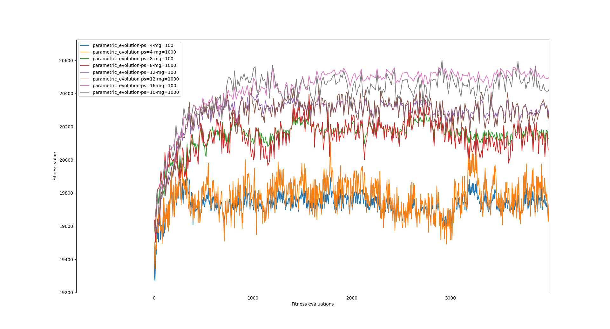

# Artificial agents

In this thesis, I implemented 4 types of artificial agents for the game Unstable Unicorns. We will start with standard agent types that are random and rule-based. The random agent is a very nice baseline for the other agents and comparison. It is very helpful for catching bugs during the development of the game simulator.

## Random agent

As the name suggests, the random agent plays random actions from the set of possible actions. It is very easy to implement because nearly every method gives us a list of possible actions then we can just pick one of them randomly.

## Rule-based agent

The rule-based agent is a bit more complicated than the random agent. The first reason is that I am not so good at this game and I do not play a lot of games. The second reason is that there are a lot of different actions that we must implement. What card should be selected to discard, and which one during destroy, should we play a card or should we activate the effect?

Then I developed a rule-based agent based on the card tier list. A tier list of cards exists nearly in every card game to measure a card's power. I found this [^tierlist] tier list on the Reddit website. Action selection is done by sorting cards by this tier list with additional changes. For example, when we need to choose a card to sacrifice then we want one of the downgrade cards first. This is easily done by changing the value of the card retrieved from the tier list. In the implementation is used subtraction by 1000. On other hand, we do not want to sacrifice upgrade cards so we add 1000 to the value of the card. A lot of functions are implemented similarly.

[^tierlist]: https://www.reddit.com/r/UnstableUnicorns/comments/himbmz/my_personal_tier_list_for_the_base_deck_first/

Two methods are implemented a little bit differently. The first method is a decision if should be used the optional effect of the card. This method always returns true because I do not see any optional effect that is bad. Some optional effects are not good to activate every time but the decision of when is effect bad or good is not so trivial.

The second method is a decision on which card to play. This method uses the tier list but instead of playing the best card, it plays the worst card. The reason is that at the start of the game, other players will likely have some instant cards to disallow you to play a good card.

With all values are working as a float because the evolutionary agent will use reuse the method implementation.

## Monte Carlo Tree Search (Mtcs) agent

The Monte Carlo Tree Search (Mcts) agent is an implementation of the Mcts algorithm described earlier in this thesis. The algorithm is not so complicated to implement but integrating it into the game simulator is a little bit tricky. The main problem is with making a specific single action and then storing the state after this action. The reason is that you can not tell who will be the next player taking the action. Some agents can be skipped by the simulator because they can not play any action. The solution is to make a helper agent that will play the action and then store the next state. This agent will be set to play for every player and these agents will share information if they played the selected action and if they should store the state. There is one additional problem to mention. You can not store directly the action that you want to play. The reason is that after the copy is made all references in the state will be different. The solution is to store the index of the action from the list of possible actions.

The last problem was how to evaluate agents during the backpropagation step. I used the simple formula: the first player gets $n-1$ points where $n$ is the number of players. The second player gets $n-2$ player and so on.

Now, I show the performance of the Mcts agents with the default strategy of rule-based agents and with the different number of playouts. In the game, there were 2 Mcts agents and 4 random agents. The Win of Mtcs agents was counted if one of the Mcts agents win. For each of the Mcts agents played 100 games. The results are shown in the table below.

| Number of playouts | Win rate of Mcts agents |
| ------------------ | ----------------------- |
| 100                | 68 %                    |
| 200                | 75 %                    |
| 400                | 81 %                    |
| 800                | 85 %                    |

As the table shows, the Mcts agent goes better with the increasing number of playouts. This behavior was expected but it is good to self-check if the implementation is correct.

## Evolutionary agent

The last implemented agent is the evolutionary one. The core behavior of this agent is the same as the rule-based agent. The difference is that the values of the cards are not hardcoded based on some tier list. Instead, the values will be chosen by the evolutionary algorithm.

I choose the float representation of individuals. Each gen of an individual represents one card and it is a number between 0 and 1 (how good is a specific card). The fitness function will be evaluated this way: Each individual will play a specific number of games and the fitness of the individual is computed by this formula:
$$
\sum_{i=1}^{\text{\#games}} 2^{n - p + 1}
$$
where $n$ is the number of players and $p$ is the final position of the player in the game. The formula has this form because I want to prefer the higher positions than the lower ones. This formula says that the first place is twice better than the second place and so on.

The selection is done by the tournament selection. The crossover is done by the arithmetic crossover. The arithmetic crossover is a simple crossover that takes the average of the parents. Finally, the mutation is done by the uniform mutation. The uniform mutation simply generates a new value for the gen.

I used the GeneticSharp library for the implementation of the evolutionary algorithm and there is a functionality that is a little bit strange. There is a high chance of making the crossover over the selected parent individuals which is normal. However, if the crossover is not performed then both individuals are thrown away and they do not make children individuals. This means that the population size is decreasing over time. This is not true because there is phase `reinsertion` after a new population is finished. This reinsertion can do a lot of things but I choose the elitism reinsertion. This reinsertion will take the best individuals from the old population and add them to the new population. This means if the chance for the crossover is 85% then on average, there is 15% of elitism.

The GeneticSharp library does not evaluate the fitness of the individuals that were already evaluated. In normal case, this is good because it saves time but in our case, we want to evaluate the fitness of the individuals again and again. Some individuals can be lucky during the fitness evaluation and they have got a good fitness. For instance, the individual can luckily win all games and then this individual will be copied to the next population and this is not good. If we evaluate all individuals no matter if they were evaluated before then the evolution will be slower but it will be more accurate for individual measurements. Theoretically, we will throw away the bad individuals and we will keep the good ones.

Then there are big questions. The first one is how many games should be played by each individual during the fitness evaluation. This is an important question because the fitness function evaluation is the most time-consuming part of the algorithm and the more games are played the longer the algorithm will take. To find it out I run the benchmark with the different number of games and initial seeds. The results are shown in the table below.

| Number of games | Initial seed | Win rate | Variance |
| --------------- | ------------ | -------- | -------- |
| 3               | 0            | 1        | 0        |
|                 | 2000         | 1        | 0        |
|                 | 5000         | 0.6667   | 0.2222   |
|                 | 9000         | 0.6667   | 0.2222   |
| 5               | 0            | 1        | 0        |
|                 | 2000         | 1        | 0        |
|                 | 5000         | 0.8      | 0.16     |
|                 | 9000         | 0.8      | 0.16     |
| 10              | 0            | 1        | 0        |
|                 | 2000         | 0.9      | 0.09     |
|                 | 5000         | 0.8      | 0.16     |
|                 | 9000         | 0.9      | 0.09     |
| 20              | 0            | 1        | 0        |
|                 | 2000         | 0.95     | 0.0475   |
|                 | 5000         | 0.9      | 0.09     |
|                 | 9000         | 0.9      | 0.09     |
| 100             | 0            | 1        | 0        |
|                 | 2000         | 0.98     | 0.0196   |
|                 | 5000         | 0.96     | 0,0384   |
|                 | 9000         | 0.98     | 0.0196   |
| 200             | 0            | 0.985    | 0.0148   |
|                 | 2000         | 0.985    | 0.0148   |
|                 | 5000         | 0.975    | 0.0244   |
|                 | 9000         | 0.99     | 0.0099   |
| 500             | 0            | 0.988    | 0.0116   |
|                 | 2000         | 0.98     | 0.0196   |
|                 | 5000         | 0.98     | 0.0196   |
|                 | 9000         | 0.99     | 0.0098   |

It shows that with the increasing number of games, the win rate is more accurate but around 200 games, the win rate accuracy is good enough. The win rate after 100,000 games is around 98.2%. Unfortunately, this number of games will take ages with more complex agents as Mcts agents with a lot of playouts. For this reason, I choose only 10 games for the fitness evaluation with Mcts agents.

The second question is better to have a smaller population and more generations or a bigger population and fewer generations. The answer depends on the problem. I made tests with different population sizes and generations. The results are shown in the figure below.

{ height=50% }

The figure shows that the bigger the population size and the fewer generations are better. The figure is clearly shown that the population relatively quickly goes to the local optimum and then it does not change much.